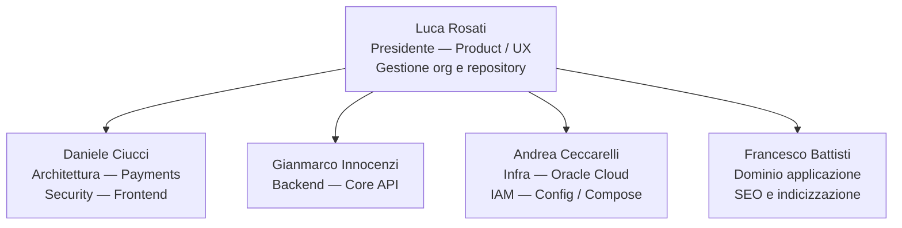
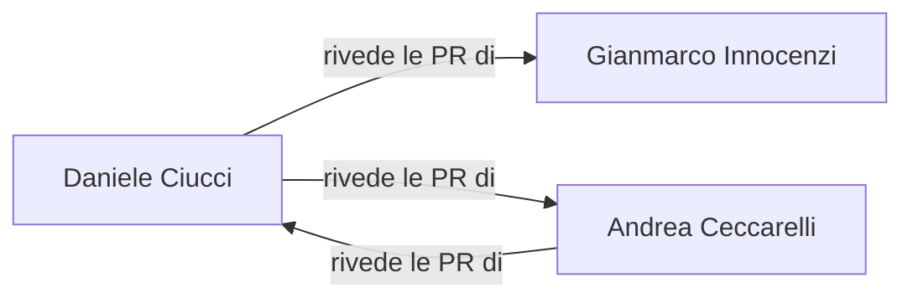

# Team di Sviluppo — Rovi Spazio Creativo ETS 🌿

Composizione del team dev, aree di competenza e flussi di revisione.
Gli username GitHub verranno aggiunti in CODEOWNERS una volta definiti.

## Ruoli e competenze

| Persona | Competenze | Aree / label |
|---|---|---|
| **Luca Rosati** | Presidente · gestione org e repository · richieste feature e UI/UX · product | product, `area: UI` |
| **Daniele Ciucci** | Architettura · flussi pagamenti · sicurezza applicativa · frontend | `area: payments`, `area: frontend`, security |
| **Gianmarco Innocenzi** | Codice backend · API e chiamate | `area: core-api` |
| **Andrea Ceccarelli** | Configurazione · Docker Compose · dimensionamento macchine · Oracle Cloud · IAM | `area: infra`, `area: iam` |
| **Francesco Battisti** | Dominio dell'applicazione · SEO e indicizzazione | `area: seo-domain` |

## Struttura del team

## Flusso di revisione (secondo revisore)

Ogni area ha un owner primario e un secondo revisore di backup,
per evitare colli di bottiglia e single point of failure.

- **Daniele ↔ Andrea**: si rivedono a vicenda (payments/frontend/security ↔ infra/iam).
- **Gianmarco** (core-api): rivisto da **Daniele**.

## Mappa area → owner → secondo revisore

| Label | Owner primario | Secondo revisore |
|---|---|---|
| `area: payments` | Daniele Ciucci | Andrea Ceccarelli |
| `area: frontend` | Daniele Ciucci | Andrea Ceccarelli |
| `area: core-api` | Gianmarco Innocenzi | Daniele Ciucci |
| `area: iam` | Andrea Ceccarelli | Daniele Ciucci |
| `area: infra` | Andrea Ceccarelli | Daniele Ciucci |
| `area: seo-domain` | Francesco Battisti | — |
